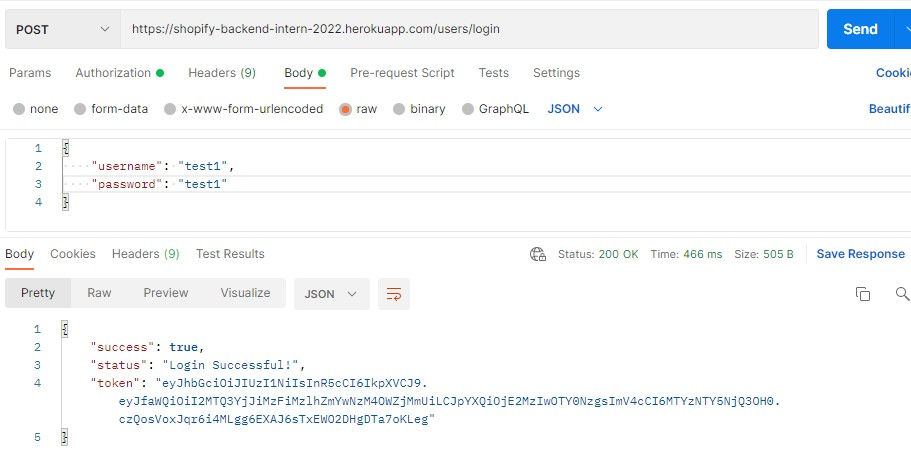
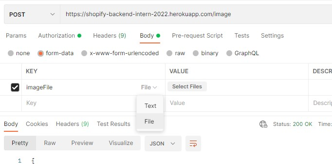

# A Rest API used for uploading and deleting images.

This is a project for [Shopify backend intern 2022 challenge](https://docs.google.com/document/d/1eg3sJTOwtyFhDopKedRD6142CFkDfWp1QvRKXNTPIOc/edit).

It is hosted on Heroku(https://shopify-backend-intern-2022.herokuapp.com/).
## Technologies.
  Nodes.js, Express, MongoDB database, Json Web Token
## Key feature.
1. User authentication(by Json Web Token).
2. Only registered users can upload and delete.
3. Add images one / bulk images.
4. Delete an image.
5. One can only delete his or her own images.
6. Response useful information after deletion and uploading.

## Important tips.
1. Only support `jpg|jpeg|png|gif|JPG` format images.
2. The maximum number of images is `10` in a uploading POST.
## How to use it?

#### Step-1 Choose an Api test platforms.
There are many free API test platforms online, such as Postman and Thunder Client. For me, I prefer to use Postman, and the following instructions are done on Postman.

### Step-2  Log in
I provide three pairs(case sensitive) of username and password as follows. You can choose any of them for testing. Each of the three accounts has already uploaded three images. 
```
[
    {
        "username": "test1",
        "password": "test1"
    },
    {
        "username": "test2",
        "password": "test2"
    },
    {
        "username": "test3",
        "password": "test3"
    }
]
```
The url for login is `https://shopify-backend-intern-2022.herokuapp.com/users/login`. 

Copy the username/password pair in the cody. Choose `raw` and `JSON` as follows. Use `POST` method and click send button.


After sending, you will receive the response of login successfully. In the body part, you will see a `token` with a long string. That is a JWT token for user authentication. Copy it and move the next step. 
## Step-3 Upload images
The url for upload is `https://shopify-backend-intern-2022.herokuapp.com/image`. 

In the `Authorization` part, choose `Bearer Token` and paste the above JWT in the Token input box. It could be seen as follows:


Then, in the `body` part, create a key named `imageFile` (should be exactly the same). Choose `Text` and click `select files` to upload images you want.


In the response body part, you will see the reponse from the API. 

`"imagesPosted"` is the information of the image you just posted. `"ImagesInDatabse"` shows all the images of your account in the database.

The `"filename"` field is the filename of your image stored in the backend. If you want to delete this image. Copy the value of it. In this case, copy `test1HaoLi.jpg` (do not include quotation mark) and move to the next step.
## Step-4 Delete images
The url for upload is `https://shopify-backend-intern-2022.herokuapp.com/filename`. 

Use the filename which you want to delete to replace the `filename` string in the above url. For example, `https://shopify-backend-intern-2022.herokuapp.com/test1HaoLi.jpg` means I will delete `test1HaoLi.jpg`. Choose `DELETE` method. You will get the response.


If you delete an image that does not exist or does not belongs to you. You will get the following error.


## Run in your own device.

`npm install` 

Install all the necessary packages.

`npm start` or `nodemon`

Start to run the server.


